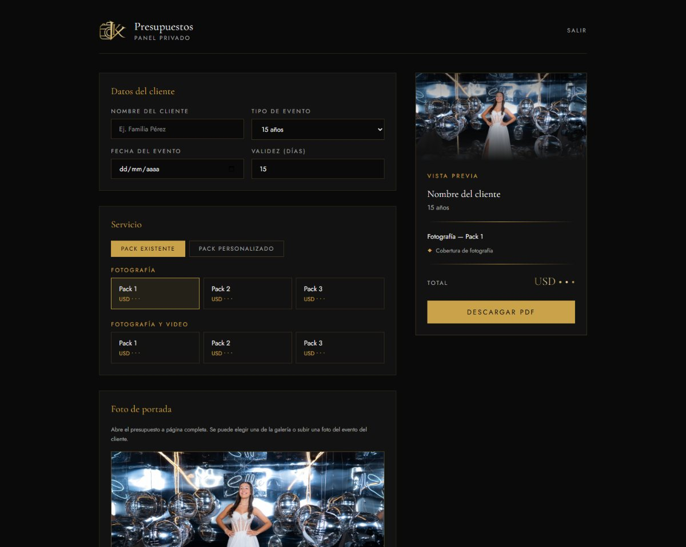
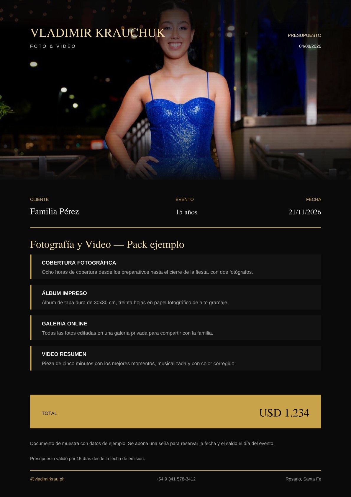
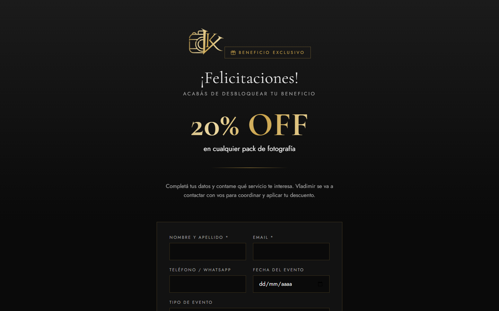
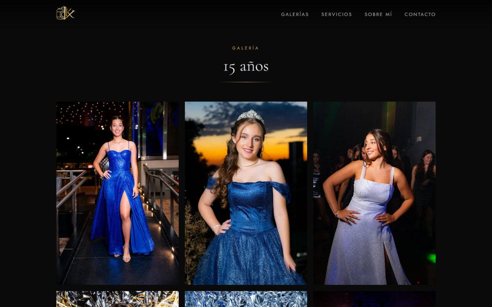

<h1 align="center">Vladimir Krauchuk · Fotografía y Video</h1>

<p align="center">
  <b>Sitio web para un estudio de fotografía y video de eventos.</b><br>
  Galerías alimentadas desde SmugMug, campaña de beneficios por QR y panel privado
  que genera presupuestos en PDF.
</p>

<p align="center">
  
  
  
  
  
</p>

<p align="center">
  
</p>

---

## El problema

Un fotógrafo de eventos no necesita solamente una web linda. Necesita que la web
le resuelva dos cosas que hoy hace a mano:

- **Cerrar presupuestos rápido.** Cuando alguien consulta por una fecha, gana el
  primero que responde con una propuesta seria.
- **Que las tarjetas personales sirvan para algo.** Reparte tarjetas en cada
  evento, pero no tenía forma de saber si alguna volvía.

El sitio está armado alrededor de esas dos necesidades.

---

## Presupuestos en PDF, en menos de un minuto

Un panel privado donde el fotógrafo carga el nombre del cliente, la fecha y el
tipo de evento, elige un pack —o arma uno a medida con los servicios sueltos— y
descarga un PDF listo para mandar por WhatsApp.

<p align="center">
  
</p>

El PDF se arma **en el navegador**, sin servidor ni servicios de terceros, y
respeta la identidad del estudio: fondo negro, dorados y la tipografía de la
marca. Abre con una foto a página completa que se funde con el fondo.

<table>
<tr>
<td width="52%">

**La foto de portada** se puede tomar de la galería del tipo de evento o subir
una del evento del propio cliente.

Como la portada es apaisada y las fotos de fiestas suelen ser verticales, el
encuadre inicial se calcula para que las caras queden dentro del recorte, y se
puede corregir con un control que muestra el resultado en vivo.

El armado también cuida el corte de página: si el total no entra junto al último
servicio, ambos pasan a la hoja siguiente, para que el precio nunca quede solo
al pie de una página vacía.

</td>
<td width="48%">

</td>
</tr>
</table>

> Los valores que aparecen en las capturas son de muestra. Los precios reales
> viven en el catálogo del proyecto pero **no se publican en ninguna página**:
> se usan solo dentro del panel y en el PDF que recibe el cliente.

---

## Beneficio por QR

Las tarjetas personales llevan un código QR que abre una página exclusiva con un
descuento. A quien la completa, le llega el pedido por email al fotógrafo.

<p align="center">
  
</p>

La página vive en una **ruta reservada**: no está enlazada desde ningún lugar del
sitio y está excluida de los buscadores, así que solo llega quien escanea el
código. La dirección se define en un único lugar del código, para poder rotarla
y regenerar el QR cuando haga falta.

---

## Galerías desde SmugMug

El fotógrafo ya trabajaba con SmugMug, así que las galerías se leen desde ahí en
lugar de duplicar las fotos: sube el material como siempre y la web se actualiza
sola.

<p align="center">
  
</p>

- Como los álbumes son públicos, alcanza con una **clave de solo lectura**: no
  hace falta pedirle sus credenciales ni pasar por OAuth.
- Una sección puede **juntar varios álbumes**, y las fotos se intercalan para que
  la grilla muestre eventos distintos desde el principio.
- Cada foto se pide **en la medida en que se va a ver** —y nunca más grande que
  el original—, para que se vea nítida sin descargar de más.
- Visor a pantalla completa con navegación por teclado.

---

## Otras decisiones

- **Precios reservados.** El catálogo incluye los valores de cada pack, pero
  nunca se exponen en las páginas públicas.
- **Formularios con aviso por email.** Validación en el servidor, campo trampa
  contra spam y envío mediante Resend.
- **Panel con sesión propia.** Usuario y contraseña con cookie firmada (HMAC),
  sin base de datos.
- **Identidad de la papelería.** Paleta y tipografías tomadas de la tarjeta
  personal del estudio. El isologo es un PNG que se recolorea por CSS, para
  poder usarlo en dorado sobre cualquier fondo.
- **Funciona sin configurar.** Sin claves de acceso el sitio levanta igual y las
  galerías muestran un estado de "muy pronto", así se puede trabajar el diseño
  antes de conectar los servicios externos.

## Stack

| Capa | Tecnología |
|---|---|
| Framework | Next.js 16 (App Router, Server Components) |
| Lenguaje | TypeScript |
| Estilos | Tailwind CSS 4 |
| Fotos | API de SmugMug |
| Emails | Resend |
| PDF | jsPDF |
| Deploy | Vercel |

## Estructura

```
app/
  page.tsx                    Portada
  galerias/[categoria]/       Galerías por tipo de evento
  packs/                      Servicios (sin precios)
  sobre-mi/  contacto/
  beneficio-vk/               Página del QR (ruta reservada, sin indexar)
  panel/                      Panel privado
  api/consulta/               Recepción de formularios
  api/panel/login/            Inicio y cierre de sesión
  api/panel/fotos/            Fotos para la portada del presupuesto
components/                   Interfaz reutilizable
lib/
  site.ts                     Datos de contacto y configuración
  packs.ts                    Catálogo de servicios y precios
  smugmug.ts                  Lectura de álbumes
  email.ts                    Envío de avisos
  auth.ts                     Sesión del panel
  pdf.ts                      Armado del presupuesto
  foto-portada.ts             Recorte de la foto de portada
tools/
  listar-albumes.mjs          Lista los álbumes de una cuenta con su clave
```

## Puesta en marcha

```bash
npm install
cp .env.example .env.local     # completar las claves
npm run dev
```

La aplicación queda disponible en `http://localhost:3000`.

Para conectar las galerías hace falta la clave de cada álbum. Se listan todas de
una vez con:

```bash
node tools/listar-albumes.mjs <cuenta-de-smugmug>
```

Las variables de entorno están documentadas en [`.env.example`](.env.example).

## Licencia

Proyecto desarrollado para un cliente. El código es de uso privado; las
fotografías y la identidad visual pertenecen a su autor.
